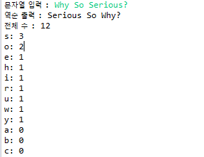

# codesquad_leveltest
## 1. 문장 통계 프로그램 

### 입력 및 출력화면

    
  

가정: 
각 문장은 알파벳으로만 이루어져 있다 이외의 문자는 마지막에만 올수있다 (W?ho are you X Who are you?? O)

구현기능: 
1. 문장의 단어 역순 출력
2. 문장에 포함되어 있는 알파벳의 전체 수를 출력한다.
3. 문장에 사용된 알파벳의 숫자를 최상위 빈도로 출력한다. 

## 2. 숫자 야구게임

### 입력 및 출력화면

  

ArrayList에 컴퓨터와 유저의 숫자를 담고 contains메소드를 이용해 구현
